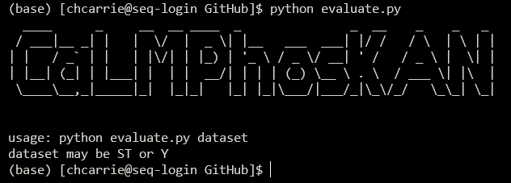
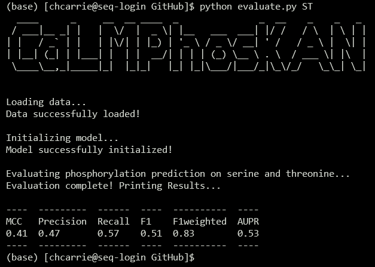
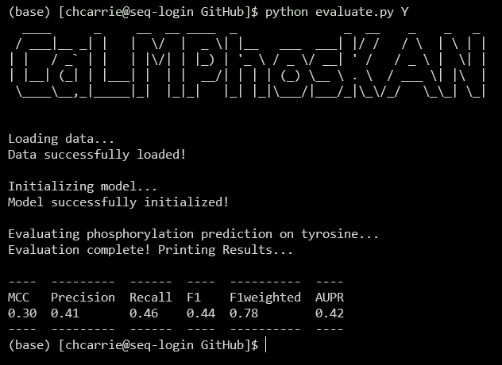

<div align="center">
  
# CaLMPhosKAN

</div>


<p align="center">
  Predict General Phosphorylation Modification in Proteins Using the Fusion of Codon-Aware Embeddings and Amino Acid-Aware Embeddings with Wavelet-based Kolmogorov–Arnold Network
</p>

<p align="center">
 
</p>

<p align="center">
<a href="https://pypi.org/project/tabulate/"></a>  
<a href="https://pytorch.org/vision/stable/index.html"></a>  
<a href="https://pypi.org/project/pyfiglet/"></a>
<a href="https://www.python.org/"></a>
<a href="https://pytorch.org/"></a>
<a href="https://scikit-learn.org/"></a>
<a href="https://numpy.org/"></a>
<a href="https://pandas.pydata.org/"></a>
<a href="https://tqdm.github.io/"></a>
<a href="https://github.com/KCLabMTU/CaLMPhosKAN/commits/main"></a>
<a href="https://github.com/KCLabMTU/CaLMPhosKAN/pulls"></a>
</p>

## About
The mapping from codon to amino acid is surjective due to the high degeneracy of the codon alphabet, suggesting that codon space might harbor higher information content. Embeddings from the codon language model have recently demonstrated success in various downstream tasks. However, predictive models for phosphorylation sites,arguably the most studied Post-Translational Modification (PTM), and PTM sites in general, have predominantly relied on amino acid-level representations. This work introduces a novel approach for the prediction of phosphorylation sites by incorporating codon-level information through embeddings from a recently developed codon language model trained on protein-coding DNA sequences. Protein sequences are first meticulously mapped to reliable coding sequences and encoded using this encoder to generate codon-aware embeddings. These embeddings are then integrated with amino acid-aware embeddings obtained from a protein language model through an early fusion strategy. Subsequently, a window-level representation of the site of interest, retaining full sequence context, is formed from the fused embeddings. A ConvBiGRU network extracts features capturing spatiotemporal correlations between proximal residues within the window, followed by a prediction head based on a Kolmogorov-Arnold Network (KAN) employing the Derivative of Gaussian (DoG) wavelet transform to produce the inference for the site.

#### Codon-aware Embeddings
The coding DNA sequences are encoded using a specialized codon-aware protein language model called CaLM (Codon adaptation Language Model). Built on the Evolutionary Sequence Modelling (ESM) framework, CaLM utilizes an architecture comprising 12 encoder layers (each with 12 attention heads) and a prediction head, amounting to 86 million parameters in total. This model undergoes pretraining using a masked language modeling denoising objective on a dataset of approximately 9 million non-redundant coding sequences derived from whole-genome sequencing.

#### Amino Acid-aware Embeddings 
Amino acid-aware embeddings are derived from a protein language model trained on a large corpus of protein sequences. In this work, we utilize a ProtTrans family model called ProtT5, a prominent pLM established for its high performance in various protein downstream tasks, including post-translational modification prediction. ProtT5 is built on the T5 (Text-to-Text Transfer Transformer) architecture and has been trained using an MLM denoising objective on the UniRef50 (UniProt Reference Clusters, encompassing 45 million protein sequences) database. The model comprises a 24-layer encoder-decoder architecture (each with 32 attention heads) and contains approximately 2.8 billion learnable parameters.

#### Wavelet Kolmogorov-Arnold Network (Wav-KAN)
Traditionally, prediction models have relied on multi-layer perceptrons (MLPs) for classification tasks. MLPs consist of multiple layers of neurons or nodes, which use fixed non-linear activation functions to learn complex relationships in the input data. Each neuron/node utilizes trainable weights to strengthen the connections that are most important for prediction.

Kolmogorov–Arnold Networks (KANs) modify this approach by placing trainable, non-linear activation functions on the edges of the network, rather than at the nodes. The nodes themselves simply sum the inputs to produce an output. You can find the original paper proposing KANs here: Kolmogorov–Arnold Network Paper, along with the accompanying GitHub repository here: [pyKAN Github](https://github.com/KindXiaoming/pykan).

Additionally, KANs can be enhanced by incorporating wavelet functions, which allow efficient capture of both low- and high-frequency components in the data. When wavelets are integrated into a KAN, the model's performance, efficiency, and robustness improve. You can find the detailed proposition of the Wavelet-KAN (Wav-KAN) in this paper: [Wavelet Kolmogorov-Arnold Network Paper](https://arxiv.org/abs/2405.12832) and the corresponding GitHub repository here: [Wav-KAN Github](https://github.com/zavareh1/Wav-KAN).

## Authors

Pawel Pratyush <sup>1</sup>, Callen Carrier<sup>2</sup>, Suresh Pokharel <sup>1</sup>, Hamid D. Ismail <sup>3</sup>, Meenal Chaudhari<sup>4</sup>, and Dukka B. KC<sup>1</sup>  

<sup>1</sup>Golisano College of Computing and Information Sciences, Rochester Institute of Technology, Rochester, 14623, New York, United States,  
<sup>2</sup>College of Computing, Michigan Technological University, Houghton, 49931, Michigan, United States,  
<sup>3</sup>College of Engineering, North Carolina Agricultural and Technical State University, Greensboro, 27411, North Carolina, United States,  
<sup>4</sup>College of Applied Sciences and Technology, Illinois State University, Normal, 61761, Illinois, United States  

## Acknowledgement

We acknowledge helpful discussions with Dr. Carlos Outeiral (University of Oxford) regarding the codon language model, Dr. Stefan Schulze (Rochester Institute of Technology) regarding codon usage, and Dr. Lukasz Kurgan (Virginia Commonwealth University) regarding disordered regions.


## Architecture

<p align="center">
 
</p>

## Build Environment 💻
The tool was developed in the following high performance computing environment, ensuring robust and efficient functionality:
- **RAM:** 384 GB
- **Processor:** Intel Xeon(R) Silver 4216 CPU @ 2.10 GHz (32 cores)
- **GPU:** NVIDIA Tesla A100 Ampere 80 GB HBM2 (6912 CUDA cores, 432 Tensor cores and bandwidth 1555GB/sec)
- **Storage:** 2TB SK hynix PC711 NVMe SSD
- **Operating System:** Ubuntu 20.04.6 LTS (64-bit)

## Use this Repository
To start using this repository and obtain a local copy, you may clone it or download it directly from Github. This repository contains the following directory structure:
```
.
├── dataset
│   ├── Readme.md
│   ├── test_Serine+Threonine.csv
│   ├── test_Tyrosine.csv
│   ├── train_Serine+Threonine.csv
│   └── train_Tyrosine.csv
├── evaluate.py
├── images
│   ├── Calmphoskan_architecture.png
│   ├── example_output_ST.png
│   ├── example_output_Y.png
│   ├── example_run.png
│   ├── mdhhs.png
│   ├── NSF_Official_logo.svg
│   └── Protein_translation.png
├── KAN.py
├── LICENSE
├── models
│   ├── ST_model.pth
│   └── Y_model.pth
├── README.md
└── requirements.txt
```

### Clone the Repository
To clone this repository using Git (which must be installed on your local system), follow these steps:

1. Open your terminal (or command prompt).

2. Run the following command to clone the repository:

```shell
git clone git@github.com:KCLabMTU/CaLMPhosKAN.git
```
This will download a local copy of the repository to your machine. Make sure that you have proper access permissions if the repository is private.

### Download the Repository Directly

If you prefer not to use Git, you can still download the repository as a ZIP file:

1. Navigate to the repository's main page.
2. Click the green **Code** dropdown button.
3. Select the **Local** tab.
4. Click **Download ZIP** to get a compressed version of the repository.

Alternatively, you can directly download the ZIP file using this link: [Download main.zip](https://github.com/KCLabMTU/CaLMPhosKAN/archive/refs/heads/main.zip)


## Independent Test Set Evaluation
### Install Libraries

Python Version: `3.11.7`

To install the required libraries, run the following command:

```shell
pip install -r requirements.txt
```
This will install these libraries and versions:

<code>numpy==2.0.1
pandas==2.2.2
pyfiglet==1.0.2
scikit_learn==1.5.1
tabulate==0.9.0
torch==2.3.1
torchvision==0.18.1
tqdm==4.66.4</code>

### Download Testing Data for Evaluation
The independent testing data (features+labels) required for evaluation can be downloaded from the following link: [CaLMPhosKAN Independent Test Data](https://drive.google.com/drive/folders/16GBz_CJCvvUyhspVAw4Qi6upQRqGRciS?usp=drive_link). This is a folder which consists of these four files:
|Name|ST_dataset.npy|ST_labels.csv|Y_dataset.npy|Y_labels.csv|
|----|--------------|-------------|-------------|------------|
|Size|6.07 GB|197 KB|1009 MB|32 KB|

#### Instructions for Data Setup:

1. **Downloading the Complete Folder:**
   - If you download the entire `data` folder, unzip it into the same directory where the evaluation script is located within the repository.
   
   > **Note:**
   > - Due to its large size, the `ST_dataset.npy` file will not be included in the folder download. This file must be downloaded separately and manually placed in the `data` folder.
   > - Ensure the `ST_dataset.npy` file is named exactly as listed (`ST_dataset.npy`). Once all files are in the `data` folder, verify that the names match the ones provided in the table above.

2. **Downloading Files Individually:**
   - If you choose to download the files individually, create a new folder named `data`, place all four files inside it, and then move this folder to the same directory as the evaluation script.

   > **Important:**
   > Before running the evaluation script, ensure that the folder is named `data` and that all files within it are named exactly as specified in the table above.

### Run Evaluation

Once the `data` folder is correctly placed and all required dependencies are installed, you can run the evaluation using the following command format:

```shell
python evaluate.py <dataset>
```
Replace `<dataset>` with either `ST` or `Y`, depending on which residue-specific model you want to evaluate. For example:

- To evaluate the model for Serine/Threonine (ST), use: `python evaluate.py ST`
- To evaluate the model for Tyrosine (Y), use: `python evaluate.py Y`


#### Output Examples
The output of a successful execution should look very similar to the screenshots that follow. Directly below is the example of the evaluation script which executed on the ST dataset...

<p align="center">
 
</p>

...and below this is the example of the evaluation script which executed on the Y dataset.

<p align="center">
 
</p>

## Funding
<p>
  <a href="https://www.nsf.gov/">
    
  </a>
 <a href="https://www.michigan.gov/mdhhs">
    
  </a>
</p>

**NSF Grant Numbers:** *1901793*, *2210356*, *2215734* (to D.B.K)

**MDHHS Grant:** Michigan Sequencing Academic Partnership for Public Health Innovation and Response (MI-SAPPHIRE) Grant


## Contact  :mailbox: 
Should you have any inquiries related to this project, please feel free to reach out via email. Kindly CC all of the following recipients in your communication for a swift response:

- Main Contact: [dkcvcs@rit.edu](mailto:dkcvcs@rit.edu) (Dr. Dukka KC)
- CC: [chcarrie@mtu.edu](mailto:chcarrie@mtu.edu) (Callen Carrier) ,[pp5291@rit.edu](mailto:pp5291@rit.edu) (Pawel Pratyush)

We look forward to addressing your queries and concerns.
