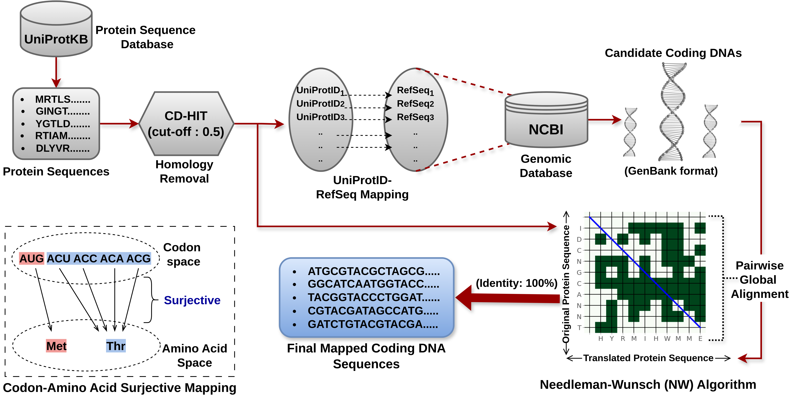

#### Distribution of the primary training set and independent testing set respective to each target residues - Serine (S), Threonine (T), and Tyrosine (Y) residues. (Adopted from the manuscript of the CaLMPhosKAN)

| Set            | Target Residue | # Coding DNA/Protein | Coding DNA Length | P-sites (+ve) | NP-sites (-ve) | Ratio (NP:P) |
|----------------|----------------|-----------------------|-------------------|----------------|-----------------|---------------|
| **Training**    | Serine (S)     | 11,363                | 1847±1540         | 110,752        | 479,531         | 4.33:1       |
|                | Threonine (T)  | 11,355                | 1848±1540         | 43,468         | 320,798         | 7.38:1       |
|                | Tyrosine (Y)   | 8,178                 | 2063±1673         | 27,077         | 123,918         | 4.57:1       |
|       |                |               |           **Total**         |    **181,297**    |               **924,247**   | **5.09:1**       |
| **Ind. Testing**| Serine (S)     | 1,248                 | 1806±1396         | 12,077         | 50,492          | 4.18:1       |
|                | Threonine (T)  | 1,246                 | 1808±1369         | 4,887          | 33,565          | 6.87:1       |
|                | Tyrosine (Y)   | 902                   | 2062±1711         | 3,054          | 13,347          | 4.37:1       |
|      |                |                |            **Total**        |      **20,018**    |          **97,404**        | **4.90:1**       |

## Notes

1. The number of sites in both train and test differs from those reported in DeepPSP (https://pubs.acs.org/doi/10.1021/acs.jproteome.0c00431) due to certain proteins not being translatable into reliable coding DNAs.
2. The procedure for translating protein sequences into coding DNAs is illustrated in the diagram below.

 
