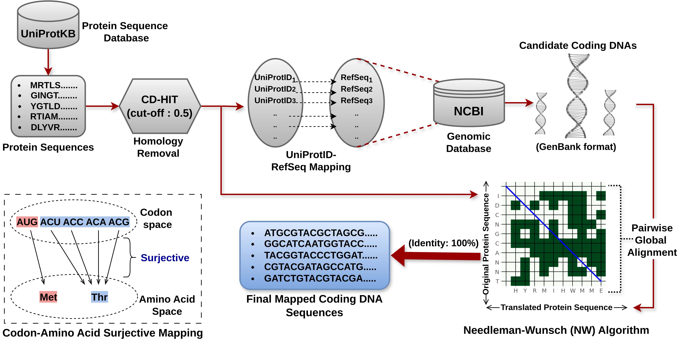

## Notes

1. The number of sites in both train and test differs from those reported in DeepPSP (https://pubs.acs.org/doi/10.1021/acs.jproteome.0c00431) due to certain proteins not being translatable into reliable coding DNAs.
2. Dataset Sources:

   Primary: https://pubs.acs.org/doi/10.1021/acs.jproteome.0c00431
   
   A549: https://academic.oup.com/bib/article/22/6/bbab244/6310410
   
   Chlamydomonas reinhardtii : https://www.nature.com/articles/s41598-021-91840-w
   
4. The procedure for translating protein sequences into coding DNAs is illustrated in the diagram below.

 
